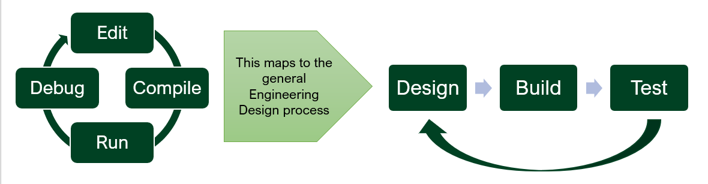
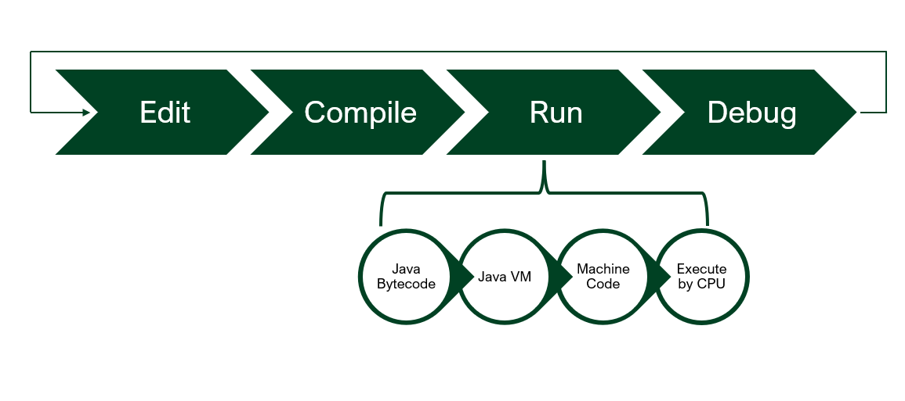
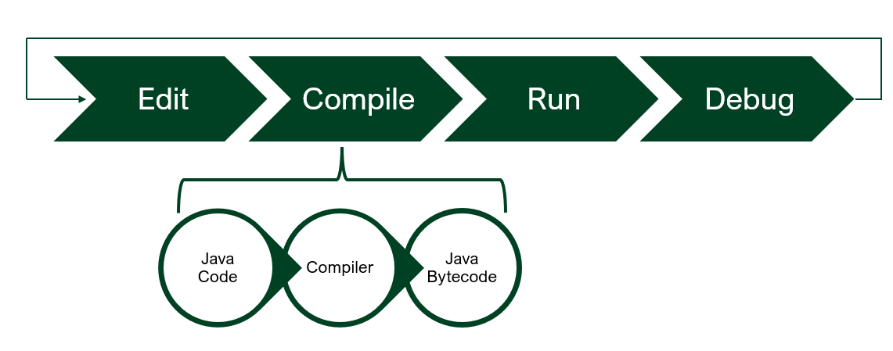
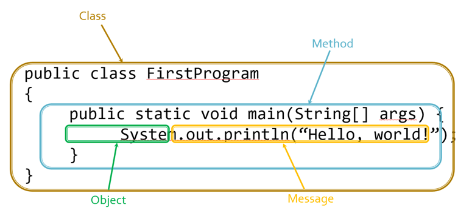

# Intro To Java
## _IB CS SL_


## About Computer Science

- Yes, it includes the study of computers and programming them
- Really it's more about how we can think and describe data problems such that a computer can carry out the work for us
- When we code, we separate out the notions of code vs. the data we're working on (and so do computers)
---

## Programming Languages

- Programming Languages are an effective means to solving problems with Computational Thinking
- Many languages exist that approach the pieces in different ways. Some have advantages over others, depending on the types of problems being solved
- Programming Languages are just layers of Abstractions of the real work the computer is doing
---

## Types of Programming Languages
 - Low level Languages 
 ```
  - Little or no abstraction from the computer's available instructions 
  (Load data from memory into register AX, Add AX and BX, etc.)
 - Machine code and Assembly Language
 ```
 - Middle Level Languages
 - Provides abstractions
```
 - Example: you write x=3, it is translated to STR 3, 0x56A4BE83 
 - Lots of built in functions to do work for you
 - Write custom functions to do specialized operations
 - Modularity and re-usability
 - Efficiency
```

 - Gives access to low level functions, access to memory directly (pointers)
 - C is a good example


High level languages
```
 - High levels of abstraction from the details about what the computer is actually doing
 - May hide big areas of work happening under the covers (memory management)
 - More human readable, using concepts that are more easily understandable
 - Java is a good example (Scratch is even higher!)
All languages eventually get translated (either compiled or interpreted) into machine language for the computer to do the real work

```
## A brief History of Java

 - Around since 1995 (Sun, then Oracle)
 - Designed to write programs for “embedded devices,” specifically TVs
 - As such, Java is designed for small, lightweight programs
 - Turns out, this makes it ideal for writing programs for the internet as well


## Key Characteristics of Java
 - “Write-once, run anywhere”
 - Java programs are compiled to bytecode rather than machine code
 - The bytecode can be executed by any Java VM on any computer
 - This provides more abstraction (a good thing)
 - Automatic memory management
 - Java tracks what memory is currently in use and reclaims memory that is no longer needed
 - Other languages (such as C/C++) require the developer to track this himself
 - Object-oriented – objects have properties and actions. We can use libraries of objects provided by others, and create our own


## Actually Writing Java Programs

 - Writing and running programs requires a number of tools:
 - An editor to write and edit the code
 - A compiler to translate the program from Java code to Java bytecode
 - A virtual machine or runtime to translate the bytecode to machine code, which the computer can execute
 - A debugger to help track down and fix problems
 - Many languages compile directly to machine code, and must be compiled separately for each type of computer/CPU





 - We could just use notepad (or any other text editor) and command-line tools
 - javac (compiler) and java (vm)
 - This is very simple and lightweight, but has a lot of drawbacks
 - Very little confirmation we’re doing things right
 - Introduces multiple potential points of failure

## OOP (Object - Oriented Programming)


OOP is based on these concepts:
 - Objects that represent actors in a program
 - Properties (aka Fields, Attributes) for each object, that store data
 - Messages that trigger behavior or request data from objects
 - Methods that perform some set of actions
 - These include getting/setting the fields/data of the object, and other actions that may interact with other objects
 - Classes that define state and behavior. It's typically a file in your set of code files that describes one type of object


## Your First Java Program


```java
public class FirstProgram {
	public static void main(String[] args){
		System.out.println(“Hello, world!”);
	}
}
```

## Writing Java Programs
 - Every Java program consists of one or more classes
 - At least one of these classes must have a “main” method. This class is typically the .java file created when you create a project
 - The “main” method defines where the program starts
 
 - Java has many, many predefined classes and objects that provide common behavior
 - System.out from our program is one example
 - Libraries prevent Java developers from having to constantly “reinvent the wheel”
 - These classes and objects (collectively referred to as the “Java API”) are documented on the Java website:
http://download.oracle.com/javase/7/docs/api/
 - Bookmark this page– it will be your Java bible


## Java Syntax

 - Java programs are made up of one or more classes, each with one or more methods, each of which consists of one or more statements

 - General Form:
 ```
 public class ClassName {
   public static void main(String[] args) {
      statement1;
      statement2;
      statement3;
      ...
      statementN;
   }
}
 ```
## Documentation

 - Documentation refers to elements of code that help a reader understand what’s going on
 - Comments are the primary, but not the only, form of documentation
 - Two types of comments in Java:
 - Single Line Comments: `// This is a Single line Comment`
 - Multi Line Comments:
```
/*
This Is a 
Multi Line Comment
*/
```
 - Comments are ignored when compiling and executing code
 - Use comments frequently to:
 - Describe the basic, high-level behavior of a chunk of code
 - Explain anything potentially unclear or tricky
 - Explain why you chose to do something a certain way if there were multiple options
Etc.
 - You should also make your code self-documenting by:
 - Choosing descriptive, readable names
 - Using line breaks
 - Indenting/aligning things well

# Bugs

 - A bug is anything that goes wrong with a program
 - Debugging is the act of going through code and fixing bugs
 - In industry, software engineers usually spend more time debugging code than they did writing it (sometimes  orders of magnitude more)
 - Bugs that can be detected before your program actually runs are called compile-time errors
 - These are usually relatively simple to find and fix, often marked in your code as you type
 - Bugs that don’t show up until you try to execute the program are called run-time errors
 - Run-time errors are generally much trickier to find. Usually this requires debugging – stepping through your code a line at a time to verify values, results along the way


