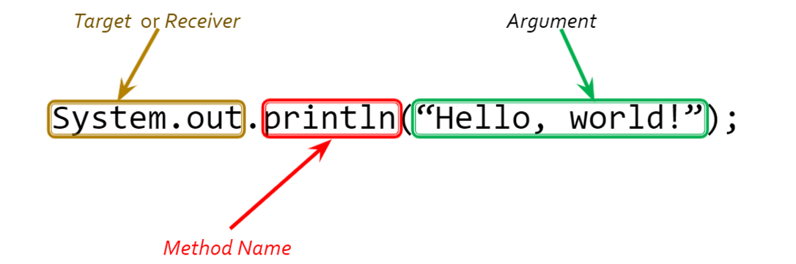

# Java Basics

## Identifiers

- The names of classes, methods, variables, etc. are referred to as identifiers
 - Identifiers can consist of letters, digits, or underscores 
 - The first character cannot be a digit
 - Identifiers should be descriptive, but not unwieldy
 - Bad: x (non-descriptive), myVariableThatIsUsedToCountSomething (too long)
 - Good: count, numTries, xCoordinate

 - Java has certain conventions for identifiers
 - Identifiers are always a single word (no spaces)
 - Class names should start with an uppercase letter, and use an uppercase letter to indicate word breaks
 - e.g. String, PrintStream, MixedFraction
 - This is called Pascal casing, or CamelCasing
 - Variables/methods/etc. should start with a lowercase letter, and be cased similarly
 - e.g. size, numLoops, firstName

## Methods
 - A method is a defined behavior of a particular class
 - Passing a message in Java is referred to as calling (or invoking) a method
 - Method calls have the following parts:
 - The target or receiver of the message is the object whose behavior we want to trigger
 - The method name of the method we want to call
 - If necessary, some number of arguments
 - Arguments provide additional information needed by the method


## Strings

 - A sequence of characters is called a string
 - Strings are usually, but not exclusively, used for input and output
 - Strings in Java are enclosed in double-quotes (“string”)
 - Identify the string in `System.out.println(“Hello, world!”);`
 - String is an example of a pre-defined Java class


## Our First Object
 - A PrintStream called System.out
 - Short version: System.out is used to output text to the console
 - Two primary methods used to print output:
 - print
 - println


## Escape Sequences

Escape sequences are prefixed with a \ (backslash)
\n – newline
\" – quotation mark
\t – tab
\\\\ - backslash
Why do we need this one?


#### Procedural Decomposition

Imagine an algorithm for making cookies:
- Making sugar cookies
 - Mix the dry ingredients
 - Cream the butter and sugar
 - Beat in the eggs
 - Stir the dry ingredients into the wet
 - Set the oven to 400°
 - Put the cookies in the oven
 - Bake for 10 minutes
 - Remove the cookies from the oven and allow them to cool
 - Mix the ingredients for the frosting
 - Frost the cookies

What if we were making a double batch?
...
 - Set the oven to 400°
 - Put the first batch of cookies in the oven
 - Bake for 10 minutes
 - Remove the cookies from the oven and allow them to cool
 - Put the second batch of cookies in the oven
 - Bake for 10 minutes
 - Remove the cookies from the oven and allow them to cool
...

This algorithm is unstructured, making it  hard to follow
 - It’s also redundant in the double batch case
 - We can do better!
 - Procedural decomposition: breaking a large task down into a number of smaller, self-contained subtasks


We can decompose our recipe into three subtasks:
 - Making sugar cookies
 - Make the batter
 - Bake the cookies
 - Frost the cookies
 - The first subtask if defined as:
 - Make the batter
 - Mix the dry ingredients
 - Cream the butter and sugar

This also allows us to eliminate redundancy in our double batch recipe:
 - Making sugar cookies (double batch)
 - Make the batter
 - Bake the cookies (batch #1)
 - Bake the cookies (batch #2)
 - Frost the cookies (batch #1)
 - Frost the cookies (batch #2)


## Static Methods

 - In Java, we employ procedural decomposition by declaring methods
 - We’ll learn about non-static (OOP/instance) methods in December
 - A static void method is a simple collection of statements
 - We’ll learn precisely what those modifiers mean soon
 - Where have you seen them before?

Three phases to using a static method:
 - Design: decide what the method will do; write an algorithm
 - Define: write the code to give your method a name and describe what it does
 - Call: use the method in main (or another method)

 - When should we define a new method?
 - Ideally a method should be:
 - Reusable: methods should consist of code we’ll need more than once
 - Specialized: each method should perform a specific subtask
 - Modular: each method should be (more or less) self-contained
 - We should not use methods to:
 - Give a single statement a new name
 - Combine unrelated statements

Syntax
```
public static void <name>() 
	{
		<statement>;
		<statement>;
		<statement>;
		...
		<statement>;
	}

```

Example

```
public static void printGreeting() 
	{
		System.out.println(“Hello, world!”);
		System.out.println(“Welcome to my program.”);
		System.out.println(“This is fun!”);
	}

```


## Calling Static Methods
```
<name>();
Example:
	public static void main(String[] args) 
	{
		printGreeting();
	}
Output:
	Hello, world!
	Welcome to my program.
	This is fun!

```
 - The point at which a method is called is referred to as the call site
 - The method that is being called is the callee
 - The method doing the calling is the caller
 - When a method is called, the program:
 - Pauses execution at the call site
 - Begins executing the callee from its beginning
 - When execution of the callee is complete, control returns to the caller at the next statement/expression after the call

```
You can also call methods from other methods:
	public static void startProgram() 
	{
	       printGreeting();
	       System.out.println(“\nAre you ready to begin?”);
	}

```
   
